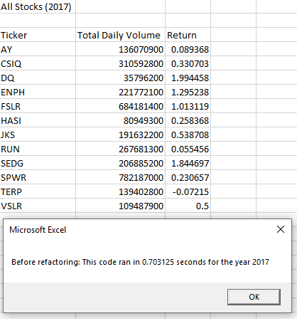
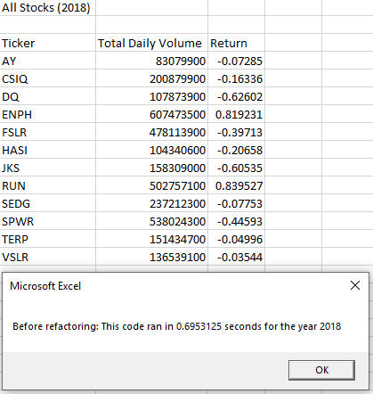
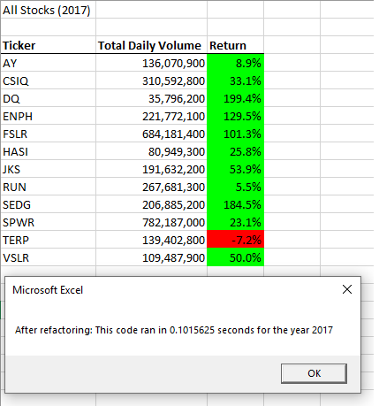
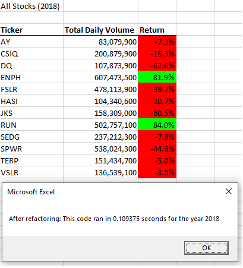

# VBA_Challenge

## Overview of Project

### Background

Steve wants to analyze the history of the entire stock market in order to help his parents to choose the best stock in which they should invest. A VBA script has already been prepared for him which analyzes the performance of all the stocks. However, the script is not optimized and suitable for a larger dataset.

### Purpose

The goal of this project is to refactor the VBA script to optimize the code and reduce the run time of the code without affecting its functionality.

## Results and Analysis

Before refactoring the code, it takes 0.703125 and 0.6953125 seconds for the original VBA script to complete the analysis of the stocks in 2017 and 2018, respectively. The two screenshots of the pop-up windows are shown below.




The for loop of the code is shown below.

```
    For i = 0 To 11
        ticker = tickers(i)
        totalVolume = 0
        Worksheets(yearValue).Activate
        For j = 2 To RowCount
            If Cells(j, 1).Value = ticker Then
                totalVolume = totalVolume + Cells(j, 8).Value
            End If
            If Cells(j - 1, 1).Value <> ticker And Cells(j, 1).Value = ticker Then
                startingPrice = Cells(j, 6).Value
            End If
            If Cells(j, 1).Value = ticker And Cells(j + 1, 1).Value <> ticker Then
                endingPrice = Cells(j, 6).Value
            End If
        Next j
        
        Worksheets("All Stocks Analysis").Activate
        Cells(4 + i, 1).Value = ticker
        Cells(4 + i, 2).Value = totalVolume
        Cells(4 + i, 3).Value = endingPrice / startingPrice - 1
        
    Next i
```

To reduce the run time of the code, the original script has been modified. Instead of having a loop that goes through the entire dataset for multiple times, the refactored code loops the dataset only once and collects all the required information. The new runtimes are shown in the screenshots below.




The modified for loop is shown below.

```
    For i = 2 To RowCount
    
        '3a) Increase volume for current ticker
        tickerVolumes(tickerIndex) = tickerVolumes(tickerIndex) + Cells(i, 8).Value
        
        '3b) Check if the current row is the first row with the selected tickerIndex.
        If Cells(i, 1).Value = tickers(tickerIndex) And Cells(i - 1, 1).Value <> tickers(tickerIndex) Then
            tickerStartingPrices(tickerIndex) = Cells(i, 6).Value
        End If
        
        '3c) check if the current row is the last row with the selected ticker
        If Cells(i, 1).Value = tickers(tickerIndex) And Cells(i + 1, 1).Value <> tickers(tickerIndex) Then
            tickerEndingPrices(tickerIndex) = Cells(i, 6).Value
            tickerIndex = tickerIndex + 1
        End If
        
    Next i
    
    '4) Loop through your arrays to output the Ticker, Total Daily Volume, and Return.
    For i = 0 To 11
        
        Worksheets("All Stocks Analysis").Activate
        Cells(4 + i, 1).Value = tickers(i)
        Cells(4 + i, 2).Value = tickerVolumes(i)
        Cells(4 + i, 3).Value = tickerEndingPrices(i) / tickerStartingPrices(i) - 1
        
    Next i
```

As can be observed, the new script is able to run around **seven times** faster than the original one. 

## Summary


- Advantages and Disadvantages of Refactoring Code
    - Advantages
       1. Refactored code is generally more optimized. It can be run faster.
       2. Refactored code can be optimized to use less resources, such as memory.
       3. Refactoring code may also reduce the complexity of the code and therefore making it more readable. 
       4. Refactoring code may improve its maintainability.
    - Disadvantages
       1. There are risks associated with refactoring codes. For example, more bugs can be created and external functionality may be changed.
       2. Without a good understanding of the whole structure of the external software development, a poorly refactored code may deteriorate the structural architecture of a software system
- Advantages and Disadvantages of the Original and the Refactored VBA Script
    - The Original Code
        - Advantages:
            1. The code is easier to understand.
            2. The code is more intuitive to write.
        - Disadvantages:
            1. The code has longer run time.
    - The Refactored VBA Script
        - Advantages:
            1. The analysis can be run faster.
        - Disadvantages:
            1. The code is more more complex to read and write.
            2. The code needs more memory to be allocated for it to run.
